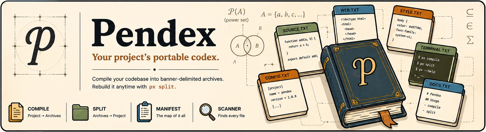

# Pendex (`px`)

> **Your project's portable codex.**

Pendex turns an entire source tree into portable, plain-text archives —
ideal for AI prompts, code reviews, backups, and sharing. Compile a
project into banner-delimited `.txt` files grouped by job (source, web,
style, terminal, configuration, documentation, testing, misc), then
reconstruct the whole tree later with `px split`.

Once compiled, a project becomes something you can paste into an LLM
context window, attach to an email, diff against an earlier snapshot,
or archive independently of git — a single, portable, human-readable
representation of a codebase that can be read as plain text and
reconstructed on demand.

Built on [Bun](https://bun.sh) + TypeScript (strict, no `any`), using
[`@clack/prompts`](https://www.npmjs.com/package/@clack/prompts) for
the interactive shell.

## About the name

Pendex comes from two sources: the mathematical notation for a **power
set** — 𝒫(A), the set of every subset of a set — and the Latin roots
behind words like _index_ and _codex_ ("one who points out"; "book,
collection"). Neither is literal — Pendex doesn't archive every
possible subset of a project's files — but the name is meant to carry
that same sense of _totality_: not a compressed export, but a
complete, canonical textual representation of a project that can be
explored, shared, and reconstructed.

| Mathematics    | Pendex                                      |
| -------------- | ------------------------------------------- |
| Set            | Project                                     |
| Elements       | Files                                       |
| Power set      | Complete representation of every file/group |
| Mapping        | `manifest.json`                             |
| Reconstruction | `px split`                                  |

That framing is also why the architecture (see below) is split the way
it is — `ArchiveFormat` (representation), `FileScanner` (discovery),
`CompileService`/`SplitService` (orchestration), `CompileView`/`SplitView`
(presentation) — each piece has exactly one well-defined responsibility,
the same way each piece of a formal system does.

## Requirements

[Bun](https://bun.sh) — this project only runs on Bun, not Node. File
I/O, globbing, TOML parsing, and shelling out all use Bun's built-ins
(`Bun.file`, `Bun.write`, `Bun.Glob`, `Bun.$`, `Bun.TOML`); there are
no `node:*` imports anywhere in `src/` or `packages/*/src`. `package.json`'s
`devEngines` enforces this at install time.

## Install

```bash
bun install
```

## Usage

### Interactive shell

```bash
bun run start
```

Presents a menu: **Compile Codebase**, **Split Archive**, **Exit Program**.

### Standalone commands

`compile` and `split` don't require the interactive shell — each
resolves its own `Config`/`Theme` via `@pendex/core`'s
`resolveRunnerDeps()` when run directly, without depending on the CLI
shell package:

```bash
bun run compile   # bun run packages/compile/src/Compile.ts
bun run split      # bun run packages/split/src/Split.ts
```

### Compiled binary

```bash
bun run build:pendex   # typechecks, then outputs ./dist/px
./dist/px
```

## Configuration

Defaults live in [`packages/core/config/config.toml`](./packages/core/config/config.toml):

- `theme` — the active theme's name (a file stem under `packages/theme/themes/`; see [Themes](#themes) below).
- `outputDir` / `rebuiltDir` — where `compile` writes archives and `split` rebuilds into, respectively.
- `exclude` — glob patterns applied globally, on top of `.gitignore`.
- `[[jobs]]` — one block per output `.txt` file:

  | Job file               | Category        |
  | ---------------------- | --------------- |
  | `1_SOURCE_FILES.txt`   | `source`        |
  | `2_WEB_FILES.txt`      | `web`           |
  | `3_STYLE_FILES.txt`    | `style`         |
  | `4_TERMINAL_FILES.txt` | `terminal`      |
  | `5_CONFIG_FILES.txt`   | `configuration` |
  | `6_DOC_FILES.txt`      | `documentation` |
  | `7_TEST_FILES.txt`     | `testing`       |
  | `8_MISC_FILES.txt`     | `misc`          |

  Each job has `filename`, `description`, `include` globs, and
  job-specific `exclude` globs. **A job with an empty `include` list is
  a _remainder_ job** — it catches every file no earlier job claimed
  (`8_MISC_FILES`) — and must stay last in the array.

At runtime, an optional `runtime.config.json` in your project root
overrides any of the above. There's no interactive settings editor;
edit `runtime.config.json` (or `config.toml` for the shipped defaults)
directly.

`ConfigManager` (`packages/core/src/Config.ts`) is a singleton: it
parses `config.toml` once per process, merges `runtime.config.json` on
top if present, and hands back the same `Config` object to every
command.

## Themes

Themes are TOML files under `packages/theme/themes/`, named by their
file stem — `pendex` (the canonical theme every other theme's section
layout must mirror), `dracula`, `tokyonight`, `onedark`, `monokaipro`.
Set `config.theme` to the theme name you want. An unknown or missing
theme name degrades to the built-in brand palette rather than
crashing — the theme is purely cosmetic and must never take the app
down.

A theme's `[brand]` table can optionally name colors after the eight
job categories above (`source`, `web`, `style`, `terminal`,
`configuration`, `documentation`, `testing`, `misc`) to drive
per-category coloring in the compile/split views; a theme without a
matching key for a category just falls back to a semantic style
instead.

## Monorepo layout

Bun workspaces, strictly acyclic package graph:

```
@pendex/color → @pendex/theme → @pendex/core → @pendex/compile + @pendex/split → pendex CLI (src/)
                                                                    @pendex/home (website — independent)
```

| Package           | What it owns                                                                                                                                           |
| ----------------- | ------------------------------------------------------------------------------------------------------------------------------------------------------ |
| `@pendex/color`   | ANSI text styling — `picocolors`-compatible API, plus 24-bit truecolor hex support                                                                     |
| `@pendex/theme`   | TOML-driven theme system (`ThemeManager`, `ThemePalette`, the `useTheme` chaining engine)                                                              |
| `@pendex/core`    | Shared domain types, `Config`/`ConfigManager`, `Constants`, `FileScanner`, `ArchiveFormat`, the base `View` class, and `bootstrap.resolveRunnerDeps()` |
| `@pendex/compile` | The `Compile` command: `CompileService` (headless orchestration) + `CompileView` (the only `@clack/prompts` caller for compiling)                      |
| `@pendex/split`   | The `Split` command: `SplitService` (headless orchestration) + `SplitView` (the only `@clack/prompts` caller for splitting)                            |
| `@pendex/home`    | The whole website — marketing home page at `/` and the user guide + generated API reference at `/docs` — one Vite package, one build                   |
| `src/` (root)     | The interactive CLI shell — `App.ts` (menu orchestrator), `commands/Exit.ts`, `utils/`                                                                 |

**Never introduce a cycle.** If a package needs to import from
something "above" it in that chain, the code belongs somewhere else —
usually `@pendex/core`.

## Architecture — layers, not files

Every non-trivial command is split into three layers with one job
each, spread across the packages above rather than folders in a single
package:

| Layer       | Lives in                                           | Owns                                                                                                                 |
| ----------- | -------------------------------------------------- | -------------------------------------------------------------------------------------------------------------------- |
| **Core**    | `@pendex/core`, `*Service.ts` in `compile`/`split` | business logic: glob resolution, manifest building, archive read/write                                               |
| **View**    | `*View.ts` in `@pendex/compile` / `@pendex/split`  | terminal rendering: intro/progress/summary — the only `@clack/prompts` caller for its command, session open to close |
| **Command** | `Compile.ts` / `Split.ts` / `src/commands/Exit.ts` | `Command` identity (`key`/`label`/`hint`), wiring a View to its deps                                                 |

```mermaid
classDiagram
    direction TB

    class Command {
        <<interface — @pendex/core>>
        +key: string
        +label: string
        +hint: string
        +execute() Promise~void~
    }

    class Compile {
        <<@pendex/compile — Command, container>>
        +execute() Promise~void~
    }
    Compile ..|> Command
    Compile --> CompileView

    class Split {
        <<@pendex/split — Command, container>>
        +execute() Promise~void~
    }
    Split ..|> Command
    Split --> SplitView

    class Exit {
        <<src/commands — no service/view split; see file comment>>
        +execute() Promise~void~
    }
    Exit ..|> Command

    class CompileView {
        <<@pendex/compile — the only clack caller for compile>>
        +render(theme, config) Promise~void~
    }
    CompileView --> CompileService
    CompileView --> FileScanner

    class SplitView {
        <<@pendex/split — the only clack caller for split>>
        +render(theme, config) Promise~void~
    }
    SplitView --> SplitService

    class CompileService {
        <<@pendex/compile — pure logic, no rendering>>
        +runCompile(config) Promise~CompileSummary~
        +compileJob(...) Promise~CompileJobResult~
        +writeManifest(...) Promise~void~
    }
    CompileService --> FileScanner
    CompileService --> ArchiveFormat

    class SplitService {
        <<@pendex/split — pure logic, no rendering>>
        +runSplit(outputDir, rebuiltDir) Promise~SplitSummary~
        +splitArchiveFile(...) Promise~SplitFileOutcome~
    }
    SplitService --> ArchiveFormat

    class FileScanner {
        <<@pendex/core — glob resolution, no I/O writes>>
        +loadIgnorePatterns(path) Promise~string[]~
        +resolveJobFiles(job, excludes, claimed) Promise~string[]~
        +findEmptyDirectories(cwd, excludes) Promise~string[]~
    }

    class ArchiveFormat {
        <<@pendex/core — single source of truth for the archive text format>>
        +buildArchiveEntry(path, content) string
        +joinArchiveEntries(entries) string
        +parseArchive(rawText) ArchivedFile[]
    }

    class ConfigManager {
        <<@pendex/core — Singleton>>
        +static getInstance() Promise~ConfigManager~
        +get() Config
        +reload() Promise~Config~
        +save() Promise~void~
    }

    class bootstrap {
        <<@pendex/core — resolveRunnerDeps()>>
        +resolveRunnerDeps() Promise~ResolvedDeps~
    }
    bootstrap --> ConfigManager
    bootstrap --> ThemeManager

    class Application {
        <<src/components/App.ts — root, intentionally unsplit>>
        +run() Promise~void~
    }
    Application "1" o-- "*" Command
    Application --> bootstrap

    class ThemeManager {
        <<@pendex/theme — Singleton>>
        +static getInstance(name) Promise~ThemeManager~
        +get() Theme
        +extended() PendexTheme
    }
    class ThemePalette {
        <<@pendex/theme — theme data, TOML parsing/validation>>
    }
    class useTheme {
        <<@pendex/theme — Proxy-based chaining, palette-agnostic>>
    }
    ThemeManager --> ThemePalette
    ThemeManager --> useTheme
```



### Why this split, and why not everywhere

- **`ArchiveFormat.ts` exists because `Compile` and `Split` used to
  each have half-knowledge of the same text format** — banners were
  _written_ in one place and _parsed_ with separately-maintained logic
  in another. That's the exact failure mode this prevents: two places
  that must agree on one thing, with nothing enforcing it. Now there's
  one file, in `@pendex/core`, that owns the format in both directions
  — and both `@pendex/compile` and `@pendex/split` depend on it rather
  than on each other.
- **`CompileService`/`SplitService` never import `@clack/prompts`.**
  That's the actual test of the boundary — if a service needed the
  terminal to do its job, the split wouldn't be real. It also means
  `runCompile()` / `runSplit()` work headlessly (used by both
  packages' standalone `import.meta.main` entry points) without
  dragging along interactive-only rendering.
- **`Exit.ts` is deliberately _not_ split** into command/service/view.
  It's one `outro()` call and a `process.exit()` — three files for
  that would be separation for its own sake. See the comment at the
  top of `src/commands/Exit.ts`.
- **`Application` (`src/components/App.ts`) is deliberately _not_
  split** either. It's the root — in the React analogy, the thing that
  mounts everything else — and its only real behavior (the menu
  select-loop) is inherently both state and render at once. Forcing
  that apart would add indirection without adding clarity.
- **`ThemePalette.ts` / `useTheme.ts`** split the same way: palette
  (_what colors mean_) from the Proxy-based chaining engine (_how
  composition works_). `useTheme.ts` doesn't know what a color is;
  `ThemePalette.ts` doesn't know how chaining works.
- **`bootstrap.resolveRunnerDeps()` lives in `@pendex/core`**, not the
  shell package, specifically so `@pendex/compile` and `@pendex/split`
  can resolve their own `{ config, theme, categoryColors }` for
  standalone runs without depending on the shell — the same reasoning
  that put `ArchiveFormat.ts` here rather than in either service.

## The website (`@pendex/home`)

The whole Pendex website is one Vite + React + Tailwind CSS v4 +
DaisyUI package, deployed to GitHub Pages as a single build:

- **`/`** — the marketing home page.
- **`/docs`** — the user guide, plus a generated API reference (via
  [TypeDoc](https://typedoc.org)) covering all five library packages
  (`color`, `theme`, `core`, `compile`, `split`).

```bash
bun run dev       # dev server, serves both / and /docs
bun run build     # builds the whole site into packages/home/dist
```

See [`packages/home/README.md`](./packages/home/README.md) for
details on the build pipeline (TypeDoc → `tsc -b` → `vite build`).

## Development

```bash
bun install          # install everything, once
bun run typecheck    # tsc --noEmit at root + every package's own typecheck
bun run test         # bun test at root (CLI shell) + every package's own tests
bun run lint         # oxlint --fix . ; oxfmt .
bun run lint:check   # oxlint . (no fixes — for CI)
bun run format:check # oxfmt --check . (no fixes — for CI)
bun run clean        # removes build output, coverage, and generated API docs
```

Linting and formatting use [Oxlint](https://oxc.rs) and
[Oxfmt](https://oxc.rs) (not ESLint/Prettier) — configured in
`.oxlintrc.json` and `.oxfmtrc.json` at the repo root.

### Conventions

- **No `any`.** The whole tree type-checks under `strict` with zero
  explicit-`any` usage, outside two intentionally out-of-scope
  standalone utilities (see [Header comments](#header-comments) below).
- **Bun over Node**, everywhere — including path manipulation
  (`joinPath`/`dirName`/`baseName`/`extName` in `Constants.ts` are
  small local string helpers, not `node:path`).
- **User-facing strings live as a `STRINGS` field on the class that
  uses them**, not in a shared strings module. Every command and view
  has its own `private readonly STRINGS = { ... } as const` at the
  top — the tradeoff is intentional: it favors "one obvious place to
  edit this copy" over textbook copy/logic separation.

For a deeper dive into project-specific gotchas, known-fixed bugs, and
guidance aimed specifically at coding agents working in this repo, see
[`AGENTS.md`](./AGENTS.md).

## Header comments

`src/utils/HeaderComments.ts` is a **separate, standalone utility** —
not part of the `px` command set, and out of scope for the layered
architecture above — that injects or strips a

```typescript
// FILE-PATH: <path>
```

comment at the top of project files. Run it directly:

```sh
bun run src/utils/HeaderComments.ts
```

## Project structure

```sh
packages/
  color/src/          ANSI styling — Colors.ts (picocolors-compatible + truecolor)
  theme/
    src/                ThemeManager.ts, ThemePalette.ts, useTheme.ts
    themes/              pendex.toml (canonical) + dracula/tokyonight/onedark/monokaipro
  core/
    src/                types.ts, Config.ts, Constants.ts, ArchiveFormat.ts,
                          FileScanner.ts, View.ts, bootstrap.ts
    config/config.toml   default Config
  compile/src/         Compile.ts, CompileService.ts, CompileView.ts
  split/src/           Split.ts, SplitService.ts, SplitView.ts
  home/                the website — see packages/home/README.md
src/
  index.ts              CLI process entry point
  components/App.ts      root orchestrator (intentionally unsplit)
  commands/Exit.ts        (intentionally unsplit — see file comment)
  utils/                 standalone, out of scope for the layered architecture
    HeaderComments.ts
    update-config.ts
    validators.ts
tests/                  root-level tests: CLI shell + cross-package integration
AGENTS.md               guidance for coding agents working in this repo
```

## License

[GNU Affero General Public License v3.0](./LICENSE.md).
