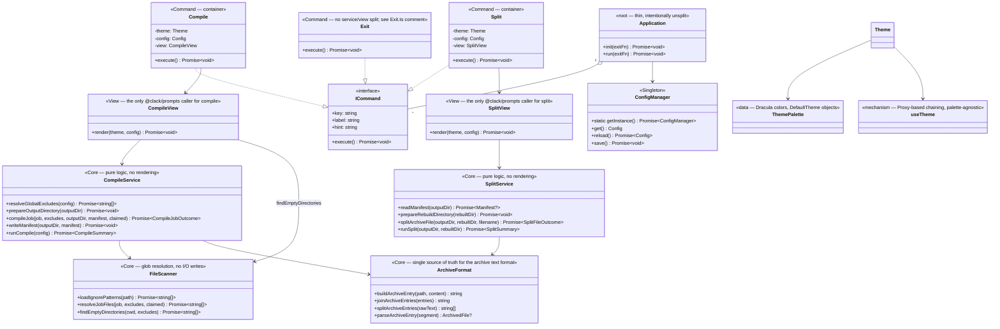

# Pendex (`px`)

> **Your project's portable codex.**

Pendex turns an entire source tree into portable, plain-text archives — ideal for AI prompts, code reviews, backups, and sharing. Compile a project into banner-delimited `.txt` files grouped by job (source, web, style, terminal, configuration, documentation, testing, misc), then reconstruct the whole tree later with `px split`.

Once compiled, a project becomes something you can paste into an LLM context window, attach to an email, diff against an earlier snapshot, or archive independently of git — a single, portable, human-readable
representation of a codebase that can be read as plain text and reconstructed on demand.

Built on [Bun](https://bun.sh) + TypeScript, using [`@clack/prompts`](https://www.npmjs.com/package/@clack/prompts) for the interactive shell.

## About the name

Pendex comes from two sources: the mathematical notation for a **power set** — 𝒫(A), the set of every subset of a set — and the Latin roots behind words like *index* and *codex* ("one who points out"; "book, collection"). Neither is literal — Pendex doesn't archive every possible subset of a project's files — but the name is meant to carry that same sense of *totality*: not a compressed export, but a complete, canonical textual representation of a project that can be explored, shared, and reconstructed.

| Mathematics    | Pendex                                      |
| -------------- | ------------------------------------------- |
| Set            | Project                                     |
| Elements       | Files                                       |
| Power set      | Complete representation of every file/group |
| Mapping        | `manifest.json`                             |
| Reconstruction | `px split`                                  |

That framing is also why the architecture (see below) is split the way it is — `ArchiveFormat` (representation), `FileScanner` (discovery), `CompileService`/`SplitService` (orchestration), `CompileView`/`SplitView` (presentation) — each piece has exactly one well-defined responsibility, the same way each piece of a formal system does.

## Install

```bash
bun install
```

## Usage

### Interactive shell

```bash
bun run start
```

Presents a menu: **Compile Codebase**, **Split Archive**, **Exit Program**.

### Standalone commands

`compile` and `split` don't require the interactive shell — each only needs a `Config`, which it loads itself via `ConfigManager` when run directly:

```bash
bun run compile   # bun run src/commands/Compile.ts
bun run split     # bun run src/commands/Split.ts
```

### Compiled binary

```bash
bun run build      # outputs ./dist/px
./dist/px
```

## Architecture — layers, not files

Every non-trivial command is split into three layers with one job each. The mental model is deliberately shaped:

| Layer       | Folder          | Owns                                                                   |
| ----------- | --------------- | ---------------------------------------------------------------------- |
| **Core**    | `src/core/`     | business logic: glob resolution, manifest building, archive read/write |
| **View**    | `src/views/`    | terminal rendering: intro/progress/summary                             |
| **Command** | `src/commands/` | `ICommand` identity (`key`/`label`/`hint`), wiring a View to its deps  |



### Why this split, and why not everywhere

- **`ArchiveFormat.ts` exists because `Compile` and `Split` used to each have half-knowledge of the same text format** — banners were *written* in one file and *parsed* with separately-maintained regexes in another. That's the exact failure mode SoC prevents: two places that must agree on one thing, with nothing enforcing it. Now there's one file that owns the format in both directions.
- **`CompileService`/`SplitService` never import `@clack/prompts`.** That's the actual test of the boundary — if a service needed the terminal to do its job, the split wouldn't be real. It also means `runCompile()` / `runSplit()` work headlessly (used by the standalone `import.meta.main` entry points) without dragging along interactive-only rendering.
- **`Exit.ts` is deliberately *not* split** into command/service/view. It's one `outro()` call and a `process.exit()` — three files for that would be separation for its own sake. See the comment at the top of `Exit.ts`.
- **`Application` (`App.ts`) is deliberately *not* split** either. It's the root — in the React analogy, the thing that mounts everything else — and its only real behavior (the menu select-loop) is inherently both state and render at once. Forcing that apart would add indirection without adding clarity.
- **`ThemePalette.ts` / `useTheme.ts`** split the same way: palette (*what colors mean*) from the Proxy-based chaining engine (*how  composition works*). `useTheme.ts` doesn't know what a color is; `ThemePalette.ts` doesn't know how chaining works. This also means swapping `picocolors` for a custom `Color` class later only touches `ThemePalette.ts`.

## Configuration

Defaults live in [`src/config/config.toml`](./src/config/config.toml):

- `outputDir` / `rebuiltDir` — where `compile` writes archives and `split` rebuilds into, respectively.
- `exclude` — glob patterns applied globally, on top of `.gitignore`.
- `[[jobs]]` — one block per output `.txt` file: `filename`, `description`, `include` globs, and job-specific `exclude` globs. **A job with an empty `include` list is a *remainder* job** — it catches every file no earlier job claimed (see `8_MISC_FILES`) — and must stay last in the array.

At runtime, an optional `runtime.config.json` in the project root overrides any of the above. There's no interactive settings editor; edit `runtime.config.json` (or `config.toml` for the shipped defaults) directly.

`ConfigManager` (`src/components/Config.ts`) is a singleton: it parses `config.toml` once per process, merges `runtime.config.json` on top if present, and hands back the same `Config` object to every command.

## Conventions

- **No `any`.** The whole tree type-checks under `strict` with zero explicit-`any` usage.
- **Bun over Node.** File I/O, globbing, TOML parsing, and shelling out all use Bun's built-ins (`Bun.file`, `Bun.write`, `Bun.Glob`, `Bun.$`, `Bun.TOML`); there are no `node:*` imports anywhere in `src/`. Path manipulation (`joinPath`/`dirName`/`baseName`/`extName` in `Constants.ts`) is implemented with small local string helpers instead of `node:path` for the same reason.
- **User-facing strings live as a `STRINGS` field on the class that uses them**, not in a shared strings module. Every command and view has its own `private readonly STRINGS = { ... } as const` at the top — the tradeoff is intentional: it favors "one obvious place to edit this copy" over textbook copy/logic separation.

## Header comments

`src/utils/HeaderComments.ts` is a **separate, standalone utility** — not part of the `px` command set, and out of scope for the layered refactor above — that injects or strips a

```typescript
// FILE-PATH: <path>
```

comment at the top  of project files. Run it directly:

```sh
bun run src/utils/HeaderComments.ts
```

## Project structure

```sh
src/
  index.ts                    entry point
  types.d.ts                  cross-layer shared types
  components/
    App.ts                     root orchestrator (intentionally unsplit)
    Config.ts                  ConfigManager singleton
    Constants.ts                generic app-wide constants + path helpers
    Theme.ts                    barrel: composes ThemePalette + useTheme
    ThemePalette.ts              theme data (colors, DefaultTheme objects)
    useTheme.ts                  theme mechanism (Proxy-based chaining)
  commands/                    Command layer — ICommand identity + wiring
    Command.ts
    Compile.ts
    Split.ts
    Exit.ts                     (intentionally unsplit — see file comment)
  core/                        Core layer — pure logic, no @clack/prompts
    ArchiveFormat.ts             archive text format (write + parse)
    FileScanner.ts                glob resolution, empty-dir detection
    CompileService.ts             compile orchestration
    SplitService.ts               split orchestration
  views/                       View layer — all terminal rendering
    CompileView.ts
    SplitView.ts
  config/
    config.toml                 default Config
  utils/                       standalone, out of scope for this refactor
    HeaderComments.ts
    update-config.ts
    validators.ts
